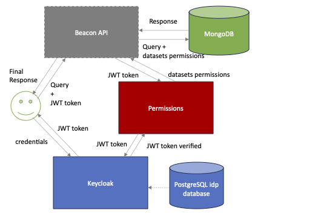

# Beacon v2.x

### Follow the new Beacon v2 Production ready product!! (now available)

The Beacon v2 Reference Implementation is just a test instance for a use case of beacon. You can use it if you like, but a new beacon product can be found as an improved and production ready product in [Beacon v2 Production Ready](https://github.com/EGA-archive/beacon-production-prototype)


### This repo
<!-- [](https://github.com/EGA-archive/beacon-2.x/actions) -->

This repository is an implementation of the [Beacon v2.0 Model](https://github.com/ga4gh-beacon/beacon-v2-Models) and contains:

* The (Python 3.9+) [source code for beacon](beacon),
* A MongoDB database with sample data to demo the capabilities of the Beacon API.
* AAI and LS-AAI integrated.


> [Local deployment instructions](deploy/README.md)

> [Frontend usage instructions](frontend/README.md)

### Managing AAI-LSAAI permissions

To give the right permissions for AAI you will need to set the permissions of the users inside permissions folder, within the [public_datasets.yml](permissions/public_datasets.yml), [registered_datasets.yml](permissions/registered_datasets.yml), [controlled_datasets.yml](permissions/controlled_datasets.yml) files, or run the beacon admin page that allows you to manage all the permissions in a friendly way and no need to open .yml files. Just start the UI, that will run in http://localhost:8010, by executing this command from the deploy folder after the containers are up and running:
```bash
docker exec beacon-permissions bash permissions/permissions-ui/start.sh
```
Note: To make the permissions ui run, create an .env file inside permissions/permissions-uiweb folder and add the next variables with the exact same names:
```bash
SECRET_KEY="your_permissions_ui_secret_key"
OIDC_RP_CLIENT_ID='your_client_id'
OIDC_RP_CLIENT_SECRET='your_client_secret'
```

Please, bear in mind that the name of the user has to be the same that you used when creating the user in LS or in IDP, whatever the AAI method you are working with.
To give a user a certain type of response for their queries, please modify this file [response_type.yml](beacon/request/response_type.yml) adding the maximum type of response you want to allow every user.

Also, you will need to edit the file [conf.py](beacon/conf.py) and introduce the domain where your keycloak is being hosted inside **idp_url**. 

Also, inside the folder permissions, before building your permissions container, you will need to create an .env file for each idp provider (e.g. lsaai.env) inside [idp_providers folder](permissions/idp_providers) you want the beacon to allow, and add the next variables (exactly named the same for each idp provider you add, see example.txt for an example):
```bash
CLIENT_ID=example_id
CLIENT_SECRET=example_secret
USER_INFO='https://example.com/userinfo'
INTROSPECTION='https://example.com/introspect'
ISSUER='https://example.com/issuer'
JWKS_URL='https://example.com/certs'
```
When you have your access token, pass it in a header with **Authorization: Bearer** in your POST request to get your answers. This token works coming from either from LS AAI or from keycloak (idp container).

### Handling CORS

To avoid CORS using beacon and the frontend or a third-party authorization site like Keycloak, you will have to include all these URLs inside [__main.py__](beacon/__main__.py), including them in the CORS middleware and CORS routes lists:
```bash
middlewares=[web.normalize_path_middleware(), middlewares.error_middleware, cors_middleware(origins=["your_URL"...
```
```bash
    for route in list(beacon.router.routes()):
        cors.add(route, {
        "your_URL":
            aiohttp_cors.ResourceOptions(allow_credentials=True,
            expose_headers="*",
            allow_methods=("POST", "PATCH", "GET", "OPTIONS"),
            allow_headers=DEFAULT_ALLOW_HEADERS),
```
### Beacon security system



### Version notes

* Fusions (`mateName`) are not supported.


### Acknowlegments

We thank the [CSC Finland](https://www.csc.fi/) team for their
contribution with a [python implementing of version
1](https://github.com/CSCfi/beacon-python). They, in turn, got help
from members of [NBIS](https://nbis.se/) and
[DDBJ](https://www.ddbj.nig.ac.jp).
